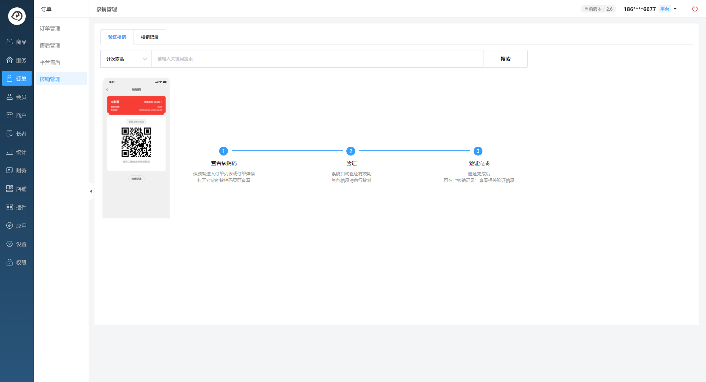
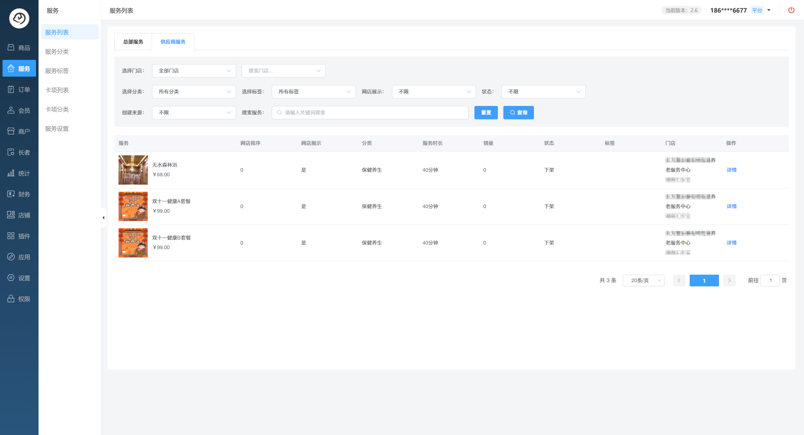
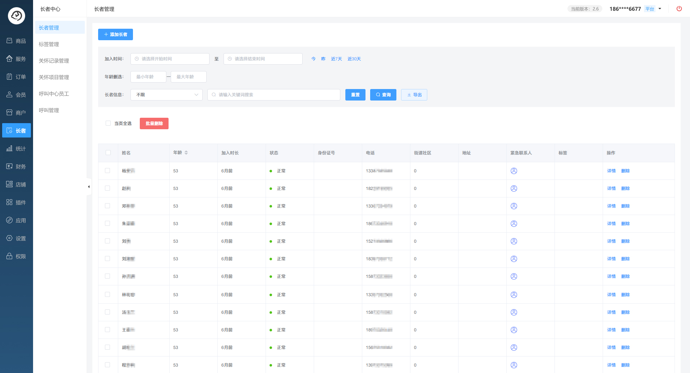

## 平台简介
🔥热门推荐中🔥小玄猪商城小程序、多端应用商城，多商户商城易于二次开发
小玄猪商城基于php、thinkphp6、vue、element-ui、、vue-element-admin、uniapp开发的商城小程序。包含小程序商城、H5商城、公众号商城、PC商城、App，拼团、砍价、秒杀、优惠券、活动报名、客户管理、推广素材、品牌、分类商品参数、知识付费、抽奖、积分、会员等级、小程序直播、页面DIY，前后端分离全部100%开源。

如果这个项目让你有所收获，记得右上角 点  ⭐️  Star，👀 Watching 关注哦，
这对我是非常不错的鼓励与支持。

## 软件技术栈

后端：php+thinkphp6.0

前端：vue-element-admin

小程序端：uniapp

部署环境建议：Linux + Nginx + PHP7.1～7.3 + MySQL5.6，或者直接用宝塔集成环境。

 **技术特点** 

标准API接口，前后端分离(分工协助 开发效率高)

统一权限(前后端一致的权限管理)

前端移动端使用UNIAPP框架编写，多端一体（支持微信小程序、微信公众号、QQ小程序、百度小程序、支付宝小程序、抖音/头条小程序、安卓、IOS）集成多个主流平台，易于维护

thinkphp6(上手简单，极易开发)

vue-element-admin (github最受欢迎前端开源管理后台框架，方便快速开发)

代码全部开源，方便企业扩展自身业务需求

 **部分PC后台截图** 

 **部分小程序截图** 

`Ω`

## 小玄猪商城开发交流群

入群前记得帮忙点一下右上角 ⭐️ ，这对我是非常不错的鼓励与支持

## 开源说明

1.本商城开源版的源码全部公开、允许用于个人学习、毕业设计、教学案例、公益事业，也允许商业使用;

2.如果商用必须保留版权信息，商用免费，但仅限自运营，请自觉遵守;

3.不允许对程序代码以任何形式、任何目的的再发行或出售，否则将追究侵权者法律责任;

4.本版本源码全部开源;包括前端，后端，无任何加密;

5.商用请仔细审查代码和漏洞，不得用于任一国家许可范围之外的商业应用，产生的一切任何后果责任自负;

6.我们的团队水平有限，也是在探索中学习、改进。开源，是为了让认可我们的用户能自由的使用、学习软件的内部架构，让更多的人有机会阅读并发现Bug、对软件项目提出改进意见。

## 项目定制

如果你不想自己开发，有项目想要外包，可以扫码联系以下微信，并注明定制开发

我们的团队包含专业的项目经理、架构师、前端工程师、后端工程师、测试工程师、运维工程师，可以提供全流程的定制服务。

项目可以是商城、SCRM 系统、OA 系统、物流系统、ERP 系统、CMS 系统、HIS 系统、支付系统、IM 聊天、微信公众号、微信小程序等等。

## 系统演示

官网介绍
https://www.pighack.com

## 特别鸣谢

thinkphp:https://www.thinkphp.cn

vue-element-admin:https://gitee.com/panjiachen/vue-element-admin

vue:https://cn.vuejs.org/

easywechat:https://www.easywechat.com/
